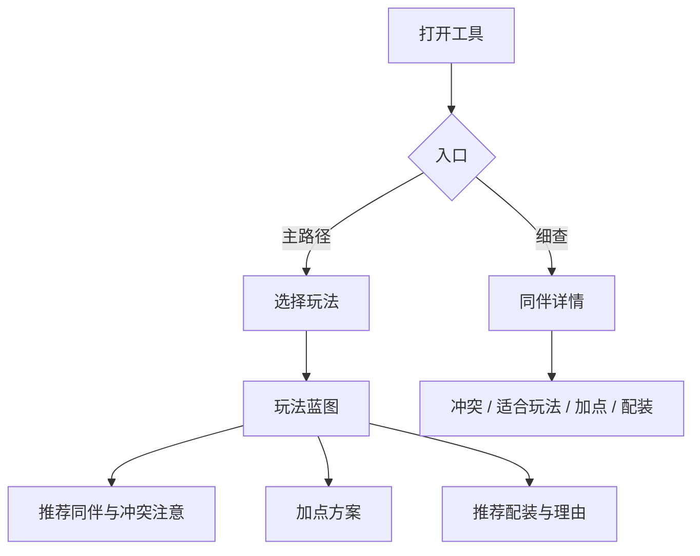

# Warband Companion Guide - Plan

## Goal Capsule

- **Objective:** 为《骑马与砍杀：战团》新手提供按玩法一键可用的同伴招募、加点与装备方案，减少瞎试。
- **Product authority:** 本文件 Product Contract；游戏版本以原版战团（卡拉迪亚）为准。
- **Open blockers:** 无（规划前无未决阻塞项）。

## Product Contract

### Summary

做一个面向战团新手的**玩法蓝图工具**：选择打仗 / 带队 / 跑商 / 混搭后，直接给出招谁、谁别一起、怎么加点、推荐配装及简短理由；也可点进单个同伴查看详情。第一版只做原版内容，结构预留日后加热门 Mod。

### Problem Frame

新手在同伴招募上容易踩坑：同伴技能定位不同，性格还会互相冲突。当前做法是瞎试，缺少「选定玩法 → 一整套可执行方案」的入口。痛点集中在开局组队、加点与买装备三个连续决策，而不是单独查某条冷知识。

### Key Decisions

- **玩法蓝图为主，同伴细查为辅。** 主价值是「选玩法就有明确方案」；图鉴式浏览是二级入口，避免新手不知道从哪下手。
- **第一版覆盖三块能力。** 招募与冲突、升级加点、装备指导同一版交付；接受内容维护成本，换取完整可用方案。
- **玩法按角色定位四选一。** 打仗 / 带队 / 跑商 / 混搭；不做阵营开局或纯兵种定位作为主分类。
- **装备给推荐配装 + 简短理由。** 既有「照着买」的清单，也有优先级说明；不做纯属性优先级表，也不穷尽所有可行配装。
- **推荐偏一条稳妥路线。** 明确不做多方案对比；用户确认接受意见型推荐。
- **原版先行，结构可扩展 Mod。** v1 只填充原版同伴与推荐数据；不实现 Mod 切换 UI，但数据组织不绑死只能原版。

### Actors

- A1. 战团新手玩家（主用户）— 需要按玩法拿到可执行同伴方案。
- A2. 内容维护者（可为同一人）— 维护原版推荐数据；日后扩展 Mod 时复用结构。

### Key Flows

- F1. 按玩法生成蓝图
  - **Trigger:** 用户选择四种玩法之一。
  - **Actors:** A1
  - **Steps:** 展示该玩法推荐同伴名单；标出互相冲突或应回避的组合；给出每人加点建议；给出推荐配装与简短理由。
  - **Outcome:** 用户得到一套可照着执行的方案，无需自行拼凑。
  - **Covered by:** R1, R2, R3, R4, R5
- F2. 同伴细查
  - **Trigger:** 用户从蓝图或入口进入某个同伴。
  - **Actors:** A1
  - **Steps:** 展示该同伴适合玩法、冲突关系、加点与配装摘要。
  - **Outcome:** 用户理解「这个人在方案里为什么出现 / 为什么不要招」。
  - **Covered by:** R6, R2, R3, R4

### Requirements

**玩法蓝图**

- R1. 用户可选择打仗、带队、跑商、混搭四种玩法之一，并看到该玩法的完整蓝图页。
- R2. 每个玩法蓝图列出推荐招募的同伴，并标明重要冲突/回避组合，避免组出互怼队伍。
- R3. 蓝图中每个推荐同伴提供升级加点建议（属性与技能方向清晰到可照着点）。
- R4. 蓝图中每个推荐同伴提供推荐配装清单，并附简短理由或属性优先级说明。
- R5. 同一玩法只呈现一条稳妥推荐路线，不提供并列多套互竞方案。

**同伴细查**

- R6. 用户可打开单个同伴详情，查看适合玩法、冲突关系、加点与配装摘要，并与蓝图信息一致。

**内容范围**

- R7. 第一版内容仅覆盖原版战团（卡拉迪亚）同伴与推荐数据。
- R8. 数据与内容组织须允许日后增加热门 Mod 数据源，但不要求 v1 提供 Mod 选择或切换界面。

### Acceptance Examples

- AE1. 选「跑商」玩法
  - **Covers:** R1, R2, R3, R4, R5
  - **Given:** 用户打开工具且尚未选玩法
  - **When:** 选择「跑商」
  - **Then:** 看到跑商向推荐同伴、冲突注意、加点与配装；且只有一套推荐，无多方案切换
- AE2. 从蓝图进入同伴详情
  - **Covers:** R6
  - **Given:** 用户正在查看某玩法蓝图
  - **When:** 点击某个推荐同伴
  - **Then:** 详情中的冲突、加点、配装与蓝图对该同伴的描述一致
- AE3. 冲突信息可执行
  - **Covers:** R2
  - **Given:** 某玩法推荐名单中存在已知互斥/冲突同伴
  - **When:** 用户阅读招募建议
  - **Then:** 能明确知道哪些人不要一起招，而不是只看到抽象「性格不合」提示

### Success Criteria

- 新手选定玩法后，能直接按页面完成「招谁 / 怎么点 / 买什么」，不再靠瞎试拼方案。
- 推荐信息足够具体：冲突可执行、加点可照着点、配装可照着买并知道为什么。

### Scope Boundaries

**Deferred for later**

- 已有同伴时的冲突检查 / 「还能招谁」
- 热门 Mod 内容与切换
- 多套互竞推荐方案对比
- 阵营/开局向玩法分类

**Outside this product's identity**

- 《骑马与砍杀 II：霸主》
- 读取游戏存档或游戏内插件
- 纯百科/长文攻略站（无玩法蓝图主路径）
- 多题诊断式性格测试向导（替代四选一玩法）

### Dependencies / Assumptions

- 假设界面与文案以简体中文为主。
- 假设交付形态为可访问的网页工具（具体技术选型留给规划阶段）。
- 假设原版同伴冲突与技能定位以社区通行认知为准，推荐内容允许意见型取舍并在文案中体现为「稳妥路线」。
- 假设第一版不依赖实时游戏数据接口。

### Outstanding Questions

**Deferred to Planning**

- 原版同伴名单与冲突矩阵的权威数据来源与校验方式。
- 四种玩法各自推荐人数上限与展示密度（避免一页过载）。
- 配装推荐粒度（具体物品名 vs 装备档位/价位带）的最终落点。
- 前端技术栈与内容数据存放格式。
