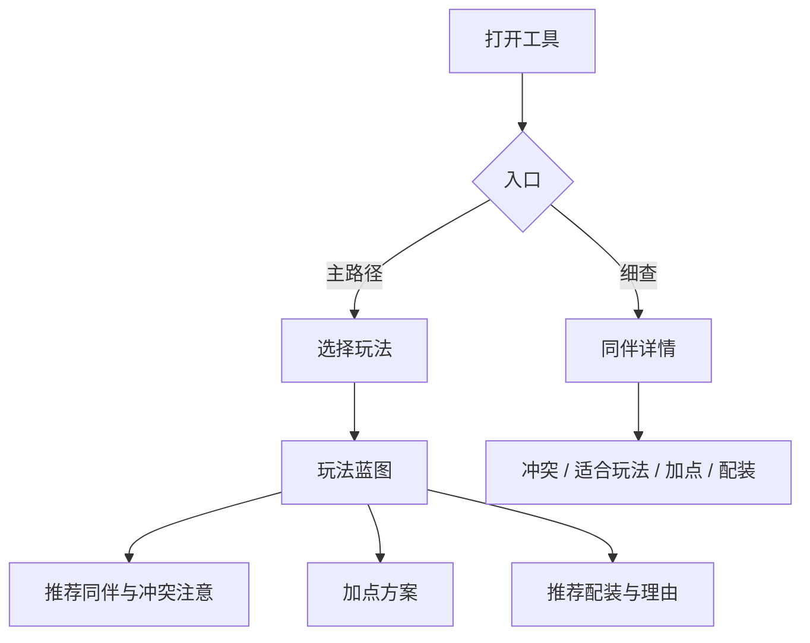
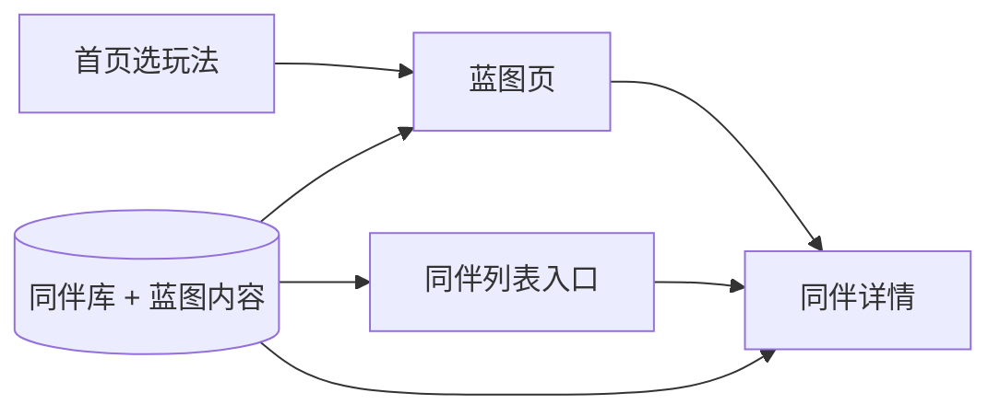
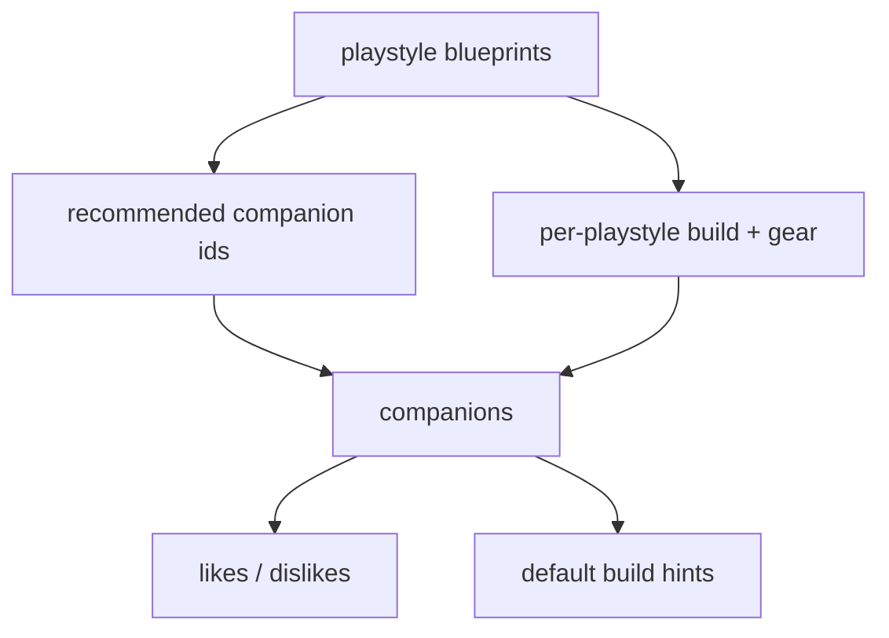

# Warband Companion Guide - Plan

## Goal Capsule

- **Objective:** 为《骑马与砍杀：战团》新手提供按玩法一键可用的同伴招募、加点与装备方案，减少瞎试。
- **Product authority:** 本文件 Product Contract；游戏版本以原版战团（卡拉迪亚）为准。
- **Tech authority:** 本文件 Planning Contract；栈为 Vite + React + TypeScript，静态内容驱动。
- **Open blockers:** 无。
- **Stop conditions:** 四处玩法蓝图与同伴详情可用；数据完整性测试与关键路径测试通过；本地可预览。

## Product Contract

### Summary

做一个面向战团新手的**玩法蓝图工具**：选择打仗 / 带队 / 跑商 / 混搭后，直接给出招谁、谁别一起、怎么加点、推荐配装及简短理由；也可点进单个同伴查看详情。第一版只做原版内容，结构预留日后加热门 Mod。

### Problem Frame

新手在同伴招募上容易踩坑：同伴技能定位不同，性格还会互相冲突。当前做法是瞎试，缺少「选定玩法 → 一整套可执行方案」的入口。痛点集中在开局组队、加点与买装备三个连续决策，而不是单独查某条冷知识。

### Key Decisions

- **玩法蓝图为主，同伴细查为辅。** 主价值是「选玩法就有明确方案」；图鉴式浏览是二级入口，避免新手不知道从哪下手。
- **第一版覆盖三块能力。** 招募与冲突、升级加点、装备指导同一版交付；接受内容维护成本，换取完整可用方案。
- **玩法按角色定位四选一。** 打仗 / 带队 / 跑商 / 混搭；不做阵营开局或纯兵种定位作为主分类。
- **装备给推荐配装 + 简短理由。** 既有「照着买」的清单，也有优先级说明；不做纯属性优先级表，也不穷尽所有可行配装。
- **推荐偏一条稳妥路线。** 明确不做多方案对比；用户确认接受意见型推荐。
- **原版先行，结构可扩展 Mod。** v1 只填充原版同伴与推荐数据；不实现 Mod 切换 UI，但数据组织不绑死只能原版。

### Actors

- A1. 战团新手玩家（主用户）— 需要按玩法拿到可执行同伴方案。
- A2. 内容维护者（可为同一人）— 维护原版推荐数据；日后扩展 Mod 时复用结构。

### Key Flows



- F1. 按玩法生成蓝图
  - **Trigger:** 用户选择四种玩法之一。
  - **Actors:** A1
  - **Steps:** 展示该玩法推荐同伴名单；标出互相冲突或应回避的组合；给出每人加点建议；给出推荐配装与简短理由。
  - **Outcome:** 用户得到一套可照着执行的方案，无需自行拼凑。
  - **Covered by:** R1, R2, R3, R4, R5
- F2. 同伴细查
  - **Trigger:** 用户从蓝图或入口进入某个同伴。
  - **Actors:** A1
  - **Steps:** 展示该同伴适合玩法、冲突关系、加点与配装摘要。
  - **Outcome:** 用户理解「这个人在方案里为什么出现 / 为什么不要招」。
  - **Covered by:** R6, R2, R3, R4

### Requirements

**玩法蓝图**

- R1. 用户可选择打仗、带队、跑商、混搭四种玩法之一，并看到该玩法的完整蓝图页。
- R2. 每个玩法蓝图列出推荐招募的同伴，并标明重要冲突/回避组合，避免组出互怼队伍。
- R3. 蓝图中每个推荐同伴提供升级加点建议（属性与技能方向清晰到可照着点）。
- R4. 蓝图中每个推荐同伴提供推荐配装清单，并附简短理由或属性优先级说明。
- R5. 同一玩法只呈现一条稳妥推荐路线，不提供并列多套互竞方案。

**同伴细查**

- R6. 用户可打开单个同伴详情，查看适合玩法、冲突关系、加点与配装摘要，并与蓝图信息一致。

**内容范围**

- R7. 第一版内容仅覆盖原版战团（卡拉迪亚）同伴与推荐数据。
- R8. 数据与内容组织须允许日后增加热门 Mod 数据源，但不要求 v1 提供 Mod 选择或切换界面。

### Acceptance Examples

- AE1. 选「跑商」玩法
  - **Covers:** R1, R2, R3, R4, R5
  - **Given:** 用户打开工具且尚未选玩法
  - **When:** 选择「跑商」
  - **Then:** 看到跑商向推荐同伴、冲突注意、加点与配装；且只有一套推荐，无多方案切换
- AE2. 从蓝图进入同伴详情
  - **Covers:** R6
  - **Given:** 用户正在查看某玩法蓝图
  - **When:** 点击某个推荐同伴
  - **Then:** 详情中的冲突、加点、配装与蓝图对该同伴的描述一致
- AE3. 冲突信息可执行
  - **Covers:** R2
  - **Given:** 某玩法推荐名单中存在已知互斥/冲突同伴
  - **When:** 用户阅读招募建议
  - **Then:** 能明确知道哪些人不要一起招，而不是只看到抽象「性格不合」提示

### Success Criteria

- 新手选定玩法后，能直接按页面完成「招谁 / 怎么点 / 买什么」，不再靠瞎试拼方案。
- 推荐信息足够具体：冲突可执行、加点可照着点、配装可照着买并知道为什么。

### Scope Boundaries

**Deferred for later**

- 已有同伴时的冲突检查 / 「还能招谁」
- 热门 Mod 内容与切换
- 多套互竞推荐方案对比
- 阵营/开局向玩法分类

**Outside this product's identity**

- 《骑马与砍杀 II：霸主》
- 读取游戏存档或游戏内插件
- 纯百科/长文攻略站（无玩法蓝图主路径）
- 多题诊断式性格测试向导（替代四选一玩法）

### Dependencies / Assumptions

- 界面与文案以简体中文为主。
- 交付形态为 Vite + React + TypeScript 静态网页（无后端）。
- 原版同伴冲突与技能定位以社区通行认知为准；推荐为意见型「稳妥路线」。
- 第一版不依赖实时游戏数据接口。
- 配装推荐使用具体物品名，并附简短理由（可含大概价位提示）。

---

## Planning Contract

### Summary

从空仓库搭建 Vite + React + TypeScript 前端；用静态 TypeScript/JSON 内容描述同伴、冲突与四处玩法蓝图；页面主路径为「选玩法 → 蓝图」，二级为「同伴详情」。内容与 UI 解耦，便于日后增加 Mod 数据集。

### Key Technical Decisions

- **KTD1. 静态站点，无后端。** 全部推荐数据打包进前端；满足 v1 只读查询，降低部署与运维成本。
- **KTD2. Vite + React + TypeScript。** 用户选定；用 React Router 做玩法蓝图与同伴详情路由。
- **KTD3. 内容分层：同伴库 + 玩法蓝图。** 同伴实体存冲突、通用简介；蓝图存玩法专属的推荐名单、加点与配装。详情页与蓝图共用同伴库，保证一致性（R6）。
- **KTD4. `source` 字段预留 Mod。** 内容记录带 `source: "native"`（或等价标签）；v1 只加载原版，不实现切换 UI（R8）。
- **KTD5. 配装用具体物品名。** 每条推荐含物品中文名 + 简短理由；可选价位提示。不做档位枚举为主。
- **KTD6. 每玩法推荐 4–6 名同伴。** 控制一页密度；冲突提示只列本蓝图内相关组合。
- **KTD7. 意见型内容可测结构、不测「正确性」。** 自动化校验 schema、引用完整性、蓝图内冲突可解析；不把攻略观点当断言。

### High-Level Technical Design





### Assumptions

- 同伴中文名与冲突关系以社区通行资料整理，允许后续人工修订。
- v1 不要求覆盖全部可招募同伴的完整图鉴文案；但蓝图引用到的同伴必须有完整详情字段。
- 样式以清晰可读为先，不做重度品牌视觉系统。

### Alternative Approaches Considered

- **纯静态 HTML：** 依赖更少，但四处玩法 × 同伴详情的交互与内容复用成本更高；已否决。
- **Vue 栈：** 可行，但用户明确选 React。
- **CMS/后端：** 过度；v1 内容变更频率低，JSON/TS 模块足够。

### Risks & Mitigations

- **内容争议：** 推荐属意见型。缓解：文案标明「稳妥路线」；结构与引用可测。
- **冲突矩阵遗漏：** 缓解：蓝图内两两冲突校验测试；内容评审清单。
- **一页信息过载：** 缓解：每玩法 4–6 人；分区展示招募 / 加点 / 装备。

### Deferred to Follow-Up Work

- 已有同伴冲突检查器
- Mod 数据集与切换 UI
- 深色主题 / 高级视觉设计
- 部署到 GitHub Pages（可在脚手架后另开）

### Open Questions

**Deferred to implementation**

- 具体同伴中文译名统一口径（实现时选定一套并贯穿）。
- 首页是否同时提供「全部同伴」入口的视觉权重（默认可有，但不压过玩法选择）。

---

## Output Structure

```text
/
├── package.json
├── vite.config.ts
├── index.html
├── src/
│   ├── main.tsx
│   ├── App.tsx
│   ├── data/
│   │   ├── types.ts
│   │   ├── companions.ts
│   │   └── blueprints.ts
│   ├── lib/
│   │   └── content.ts
│   ├── pages/
│   │   ├── HomePage.tsx
│   │   ├── BlueprintPage.tsx
│   │   ├── CompanionPage.tsx
│   │   └── CompanionListPage.tsx
│   ├── components/
│   │   ├── PlaystylePicker.tsx
│   │   ├── CompanionCard.tsx
│   │   ├── ConflictNotes.tsx
│   │   ├── BuildBlock.tsx
│   │   └── GearBlock.tsx
│   └── styles/
│       └── global.css
└── src/**/*.test.ts(x)
```

---

## Implementation Units

### U1. 项目脚手架

- **Goal:** 空仓库可运行的 Vite + React + TypeScript 应用骨架与基础路由壳。
- **Requirements:** 支撑后续 R1–R6 的承载环境
- **Dependencies:** 无
- **Files:**
  - create: `package.json`, `vite.config.ts`, `vitest.config.ts`, `tsconfig.json`, `tsconfig.app.json`, `index.html`, `.gitignore`
  - create: `src/main.tsx`, `src/App.tsx`, `src/styles/global.css`
  - create: `README.md`（更新为项目说明与本地启动）
- **Approach:** 使用官方 Vite React-TS 模板约定；配置 React Router 占位路由（首页 / 蓝图 / 同伴）；配置 Vitest（含 React Testing Library）供后续单位使用；中文页面标题。
- **Execution note:** Prefer install/runtime smoke（`dev` 能打开）over 重型单元测试。
- **Test scenarios:**
  - Test expectation: none -- 纯脚手架；用本地启动冒烟验证。
- **Verification:** `npm install` 后开发服务器可打开空白壳页面；`npm test` 可运行（允许尚无用例）；路由切换不报错。

### U2. 内容模型与原版数据

- **Goal:** 定义同伴与玩法蓝图的类型与原版数据集；提供查询辅助函数。
- **Requirements:** R2, R3, R4, R5, R7, R8
- **Dependencies:** U1
- **Files:**
  - create: `src/data/types.ts`, `src/data/companions.ts`, `src/data/blueprints.ts`
  - create: `src/lib/content.ts`
  - create: `src/data/content.integrity.test.ts`
- **Approach:**
  - 同伴字段至少含：id、中文名、简介、likes/dislikes（同伴 id）、source。
  - 蓝图字段至少含：playstyle id（combat/leadership/trade/hybrid）、标题、推荐同伴 id 列表、每人加点、每人配装（物品名 + 理由）、蓝图级冲突注意文案或由 likes/dislikes 派生。
  - 四处玩法各 4–6 名推荐同伴；配装用具体物品名。
  - `content.ts` 提供：按玩法取蓝图、按 id 取同伴、解析某蓝图内冲突对、校验引用存在。
- **Execution note:** 先写 integrity 测试再填/修数据，保证引用完整。
- **Test scenarios:**
  - 四处玩法蓝图均可加载，且各有 4–6 名推荐同伴。
  - 蓝图引用的每个 companion id 都存在于同伴库。
  - likes/dislikes 引用的 id 均存在；无效自引用被拒绝。
  - 同一玩法仅一条蓝图记录（覆盖 R5 数据结构）。
  - 所有内容记录 `source` 为原版标签。
  - 每名蓝图同伴的加点与配装字段非空；配装含物品名与理由。
- **Verification:** integrity 测试通过；可通过辅助函数取出「跑商」蓝图及完整同伴对象。

### U3. 玩法选择与蓝图页

- **Goal:** 实现主路径：选玩法 → 展示完整蓝图（招募、冲突、加点、配装）。
- **Requirements:** R1, R2, R3, R4, R5; F1; AE1, AE3
- **Dependencies:** U2
- **Files:**
  - create: `src/pages/HomePage.tsx`, `src/pages/BlueprintPage.tsx`
  - create: `src/components/PlaystylePicker.tsx`, `src/components/ConflictNotes.tsx`, `src/components/BuildBlock.tsx`, `src/components/GearBlock.tsx`, `src/components/CompanionCard.tsx`
  - create: `src/pages/BlueprintPage.test.tsx`
  - modify: `src/App.tsx`（挂路由）
- **Approach:** 首页四选一；蓝图页按区分块展示。冲突提示必须点名「谁和谁别一起」。同伴名可点击进入详情（为 U4 预留链接）。不提供多方案切换控件。
- **Execution note:** Start with a failing test for「选择跑商后看到推荐与冲突注意」。
- **Test scenarios:**
  - Covers AE1. 选择「跑商」后出现推荐同伴、冲突注意、加点与配装区块；无多方案切换。
  - Covers AE3. 当蓝图内存在互斥组合时，冲突区出现可执行的点名提示。
  - 选择「打仗」进入对应蓝图，标题/内容与跑商不同。
  - 蓝图页不渲染第二套互竞方案入口。
- **Verification:** 手动走完四玩法切换；跑商路径自动化测试通过。

### U4. 同伴详情与列表入口

- **Goal:** 同伴详情页展示适合玩法、冲突、加点与配装摘要，并与蓝图一致；提供轻量列表入口。
- **Requirements:** R6; F2; AE2
- **Dependencies:** U3
- **Files:**
  - create: `src/pages/CompanionPage.tsx`, `src/pages/CompanionListPage.tsx`
  - create: `src/pages/CompanionPage.test.tsx`
  - modify: `src/App.tsx`, `src/components/CompanionCard.tsx`（如需）
- **Approach:** 详情数据优先来自同伴库；玩法相关加点/配装若蓝图有覆盖则展示「在某玩法下的建议」，并与蓝图同源字段读取，避免两处手写分叉。列表页仅作二级入口，不压过首页玩法选择。
- **Test scenarios:**
  - Covers AE2. 从跑商蓝图点进某同伴，详情中冲突/加点/配装与蓝图一致。
  - 未知 companion id 路由显示明确「未找到」状态，不白屏。
  - 列表页可进入同一详情且内容一致。
- **Verification:** AE2 测试通过；手动从蓝图与列表两条路径进入详情一致。

### U5. 中文文案打磨与 README

- **Goal:** 统一简体中文用语、空态与页头说明；README 写清如何改内容数据。
- **Requirements:** Success criteria；A2 可维护性
- **Dependencies:** U4
- **Files:**
  - modify: 各页面/组件文案与 `src/styles/global.css`
  - modify: `README.md`
- **Approach:** 标明「稳妥路线 / 意见向推荐」；说明数据文件位置与如何新增同伴字段；保持移动端基本可读（单列优先）。
- **Test scenarios:**
  - Test expectation: none -- 文案与文档打磨；用视觉冒烟确认。
- **Verification:** README 可指导他人改 `companions`/`blueprints`；手机宽度下主路径仍可完成阅读。

---

## Verification Contract

| Gate | 适用 | 说明 |
|---|---|---|
| 安装与类型检查 | 全局 | 依赖可安装；`tsc`/构建无类型错误 |
| 单元/组件测试 | U2–U4 | integrity + 蓝图/详情关键路径 |
| 构建 | 全局 | 生产构建成功 |
| 手动冒烟 | 全局 | 四玩法切换、蓝图→详情、列表→详情 |

具体命令以脚手架生成的 `package.json` scripts 为准（预期含 `dev` / `test` / `build`）。

---

## Definition of Done

- [ ] U1–U5 均完成且满足各单位 Verification
- [ ] R1–R8 均有对应实现或数据覆盖
- [ ] AE1–AE3 有自动化或等价手动证明
- [ ] 四处玩法均可给出可执行的招募/加点/配装方案
- [ ] 无阻塞性控制台错误；生产构建通过
- [ ] README 说明本地启动与内容修改方式
